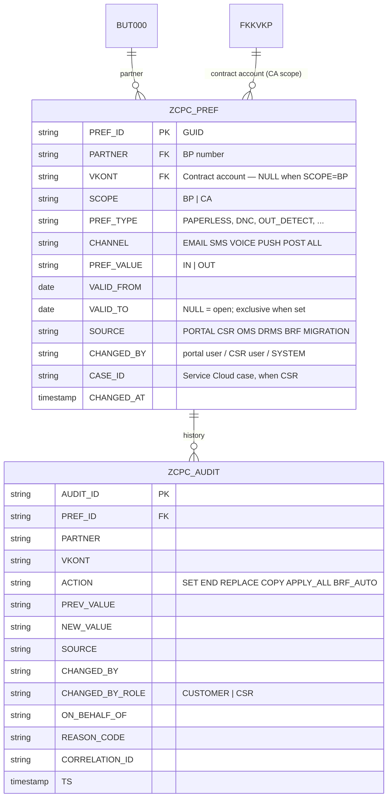
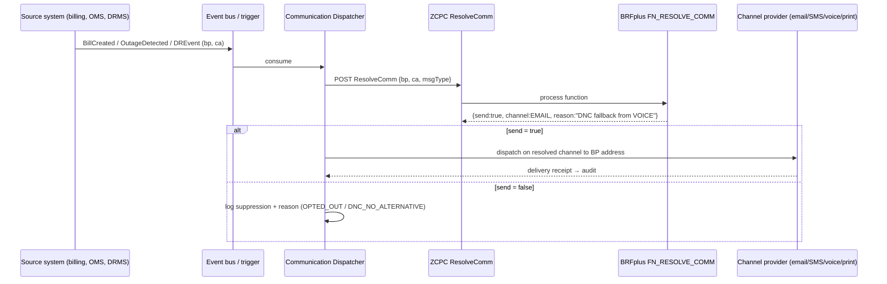

# Customer Preference Center — BRFplus Architecture & API Design

**Scope.** Customers (portal, `svgbs.com/cpc`) and CSRs (SAP Service Cloud V2 mashup)
maintain communication preferences. Preferences are stored and evaluated in an
**SAP S/4HANA for Utilities BRFplus application**. When a preference-relevant event
fires (bill ready, outage, move-in/move-out, DR event…), the application resolves *whether*
and *how* to communicate with the customer from those preferences — including BP-level
Do-Not-Call — and dispatches on the permitted channel.

> **Landscape caveat.** Standard SAP artifact names below (`API_BUSINESS_PARTNER`,
> FDT classes, event topics) are real SAP objects but their availability and exact
> shape depend on your S/4HANA release, deployment (on-premise / private cloud), and
> enabled scope. Every one is marked **[validate]** and must be confirmed against your
> landscape. All `Z*` artifacts are custom developments this document specifies.

---

## 1. Solution context

```mermaid
flowchart LR
    CUST[Customer\nPortal svgbs.com/cpc] -->|HTTPS OAuth| GW
    CSR[CSR\nService Cloud V2\nURL mashup + params] -->|HTTPS iframe| GW
    subgraph BTP[SAP BTP]
      GW[API Management /\nIntegration Suite\npolicies · mapping · throttling]
    end
    GW -->|OData / principal propagation| S4
    subgraph S4[SAP S/4HANA for Utilities]
      RAP[ZCPC Preference Service\n(RAP OData V4 — custom)]
      ZT[(ZCPC_PREF / ZCPC_AUDIT\nZ-tables — record store)]
      BRF[BRFplus application ZCPC\nrules + decisions]
      BP[Business Partner\nContract Account FI-CA]
      EVT[Business events\nMove-In/Out · BP change · Bill created]
    end
    RAP --> ZT
    RAP --> BRF
    RAP --> BP
    EVT --> BRF
    BRF --> DISP[Communication Dispatcher\n(Email / SMS / Push / Print provider)]
    DISP --> CUSTOUT[Customer receives message\non permitted channel]
```

Both channels call the **same API** — the CSR mashup and the portal differ only in
authentication context and the `source`/`changedBy` attribution they carry.

---

## 2. Where exactly do preferences live? (the BRFplus decision)

Your requirement is "store in the BRFplus application." There are two ways to honor
it; we document both and recommend the hybrid.

### Option A — Recommended hybrid: Z-table records + BRFplus rules

| Concern | Artifact |
|---|---|
| Preference **records** (per BP/CA, validity-dated, audited) | Custom tables `ZCPC_PREF`, `ZCPC_AUDIT` |
| Preference **logic** (defaults, DNC policy, channel fallback, event auto-processing) | BRFplus application `ZCPC` |

Why: BRFplus decision tables are versioned *design-time* artifacts. They are excellent
for **rules** (tens–hundreds of rows, changed by admins, transported) but not built for
**high-volume transactional writes** (millions of customer rows, changed by customers
at runtime). Writing a customer's toggle into a decision table means a design-time
change + activation per save — slow, lock-prone, and it floods the BRFplus version
store. The hybrid keeps every *decision* in BRFplus (so business admins own the rules
in the BRF workbench, per your CPC10–14 spec) while records sit in a proper table the
rules read via a DB lookup expression.

### Option B — Literal: preference records *inside* BRFplus decision tables

If records must physically live in BRFplus (e.g., audit/versioning of BRFplus is the
attraction), the write path uses SAP's FDT maintenance API to insert/update decision
table rows, then activates:

- `IF_FDT_DECISION_TABLE` / `CL_FDT_FACTORY` — programmatic row maintenance **[validate]**
- `IF_FDT_TRANSACTION` — save/activate in one LUW **[validate]**
- XML import/export for mass changes: BRFplus *Table Data Exchange* **[validate]**

Consequences to accept: every save is a BRFplus version (storage growth, DB locking on
the same decision table object, activation time in the save path ~seconds), and
transport behavior must be set to "local/system-specific" so customer data never rides
a transport. **We implement the same `ZCPC_PREF_API` interface either way** — the
storage choice is invisible to the portal, the mashup, and Service Cloud.

---

## 3. BRFplus application design (`ZCPC`)

| Object | Type | Purpose |
|---|---|---|
| `ZCPC` | Application | Container; storage type "Customizing" for rules (Option A) / + "Master data" tables (Option B) |
| `FN_RESOLVE_COMM` | Function (event mode) | **The core decision**: given BP, CA, message type → `SEND?`, `CHANNEL`, `FALLBACK_REASON` |
| `FN_AUTO_PROCESS_EVENT` | Function | CPC10–14: given a BO event (MOVE_IN, MOVE_OUT, BP_CHANGE) → list of preference actions (SET/END + defaults) |
| `FN_VALIDATE_CHANGE` | Function | Save-time validation: mandatory types (e.g. PAST_DUE) cannot be opted out; channel allowed for type; DNC scope = BP |
| `DT_PREF_DEFAULTS` | Decision table | Per preference type: default value, allowed channels, scope (BP/CA), mandatory flag |
| `DT_DNC_POLICY` | Decision table | DNC/DNM suppression + fallback order per message type (VOICE→SMS→EMAIL…) |
| `DT_EVENT_RULES` | Decision table | Which BO event ends/creates which preference types (Move-Out ends marketing; Move-In seeds CA defaults; **BP-scope rows are never touched**) |
| `DT_CUSTOMER_PREFS` | Decision table *(Option B only)* | The preference records themselves: BP, CA(null=BP-wide), type, channel, value, valid-from/to, source, changed-by |
| `EXPR_LOOKUP_PREFS` | DB lookup *(Option A)* | Reads `ZCPC_PREF` active records into the rule context |
| `RS_COMM` | Ruleset | Orchestrates lookup → DNC policy → fallback → result |

**Decision semantics implemented in `RS_COMM`** (matches the verified UI logic):

1. Read effective preference for (BP, CA, type); BP-scoped types (DNC, DNM,
   THIRD_PARTY) are read with CA = *null* so one record governs all accounts.
2. If value ≠ `IN` → `SEND = false`, reason `OPTED_OUT`.
3. If chosen channel = VOICE and DNC active → fallback to first permitted non-voice,
   non-post channel from `DT_DNC_POLICY`; none → suppress, reason `DNC_NO_ALTERNATIVE`.
4. Same for POST under Do-Not-Mail.
5. Validity is a **half-open interval `[valid_from, valid_to)`** — a record ended today
   is inactive today; the replacing record starts today with no gap and no overlap.
   *(This convention must be identical in BRFplus, the Z-table, and every consumer —
   an off-by-one here was the one real bug found while testing the UI.)*

---

## 4. Data model



Rules: records are **end-dated, never deleted** (CPC03); an audit row is written in the
same LUW as every change; BP-scoped rows carry `VKONT = NULL`.

---

## 5. API catalog

### 5.1 Custom Preference Service — `ZCPC` RAP OData V4 (this is the system of record API)

Base: `/sap/opu/odata4/sap/zcpc/srvd/sap/zcpc_pref/0001/` (naming per your standards).
Exposed to BTP via a communication arrangement for the custom scenario; consumed by
portal and mashup through API Management. **No SAP-standard API exists for this — these
are the custom services this document specifies.**

| # | Operation | Method & path | Purpose |
|---|---|---|---|
| 1 | Read active preferences | `GET Preferences?$filter=Partner eq '{bp}' and (Vkont eq '{ca}' or Scope eq 'BP') and Active eq true` | Merged BP + CA view the UI renders |
| 2 | Read with history | `GET Preferences?...&IncludeHistory=true` | CPC01 Show History |
| 3 | **Bulk save (create/change/end)** | `POST SaveChanges` (action) | The single write entry point — exact payload the UI already produces (below) |
| 4 | End one preference | `POST Preferences('{id}')/End` (action) | CPC03; sets `VALID_TO = today` |
| 5 | Copy between accounts | `POST CopyPreferences` `{fromCa, toCa, validFrom}` | CPC02 — copies **CA-scope** rows only |
| 6 | Apply to all accounts | `POST ApplyAll` `{partner}` | CPC04 — CA-scope only; BP rows already global |
| 7 | Resolve communication | `POST ResolveComm` `{partner, vkont, msgType}` → `{send, channel, address, reason}` | Wraps BRFplus `FN_RESOLVE_COMM` for any consumer (dispatcher, preview, Service Cloud) |
| 8 | Audit trail | `GET AuditLog?$filter=Partner eq '{bp}'` | Regulator/CSR view |
| 9 | Catalog | `GET PreferenceTypes` | `DT_PREF_DEFAULTS` projection: types, channels, scope, mandatory |

**SaveChanges payload** (already emitted by the UI, verified):

```json
{
  "businessPartner": "0000100045",
  "contractAccount": "200045678",
  "source": "CSR",
  "changedBy": "kbutts",
  "changedByRole": "CSR",
  "onBehalfOf": "0000100045",
  "caseId": "8000123",
  "changes": [
    { "operation": "REPLACE",
      "preferenceType": "DNC",
      "scope": "BP",
      "contractAccount": null,
      "channel": "VOICE",
      "value": "OUT",
      "validFromNew": "2026-08-17",
      "endedRecordId": "PR-UMX5XL",
      "previousValue": "IN/VOICE",
      "reasonCode": "CUSTOMER_REQUEST" }
  ]
}
```

Server-side processing of `SaveChanges` (one LUW):
`FN_VALIDATE_CHANGE` (reject opt-out of mandatory types, invalid channel, CA on a BP-scope
type) → end-date old rows → insert new rows → write `ZCPC_AUDIT` → raise
`zcpc/PreferenceChanged` event. Errors: `400` validation (per-change detail), `403`
foreign BP (customer role may only write own partner), `409` concurrent change
(optimistic lock on `CHANGED_AT`), `422` business rule.

### 5.2 Standard SAP APIs used (named, not invented)

| API | Use here | Status |
|---|---|---|
| `API_BUSINESS_PARTNER` (OData V2) | CPC05 — read/update BP phone, mobile, email when the customer corrects contact data during preference maintenance | Standard **[validate scope/release]** |
| SAP Event Mesh / Enterprise Event Enablement — `sap/s4/beh/businesspartner/v1/BusinessPartner/Changed/v1` | Detect BP contact changes → re-validate channel addresses | Standard topic **[validate]** |
| IS-U move-in/move-out business events / BOR events (`ISUMOVEIN*` / `ISUMOVEOUT*`) | Trigger `FN_AUTO_PROCESS_EVENT` (CPC10–14) | Release-dependent — on-premise may use BOR events + workflow or a BAdI in move-in/out processing instead **[validate]** |
| BRFplus processing API — ABAP `CL_FDT_FUNCTION_PROCESS=>PROCESS` | How the RAP service and event handlers invoke `FN_RESOLVE_COMM` / `FN_AUTO_PROCESS_EVENT` in-stack | Standard FDT API **[validate]** |
| BRFplus maintenance API — `IF_FDT_DECISION_TABLE`, `IF_FDT_TRANSACTION` | Option B writes; also admin mass-maintenance of rule tables | Standard FDT API **[validate]** |
| BRFplus generated web service (SOAP) | Only if a non-ABAP consumer must call a BRF function directly without the RAP wrapper — generated per function from the BRF workbench | Standard generator **[validate]** |
| FI-CA contract account read (`Contract Account` OData / `BAPI_CTRACCONTRACTACCOUNT_GET`-family) | Validate CA belongs to BP before save | **[validate per release]** |

> There is **no SAP-standard OData API to create/update BRFplus decision-table rows** —
> that is precisely why `ZCPC` (5.1) exists as the wrapper. Anything claiming otherwise
> should be treated as unvalidated.

### 5.3 Events published by the preference application

| Event | Payload | Consumers |
|---|---|---|
| `zcpc/PreferenceChanged` | bp, ca, scope, type, old, new, source, changedBy, caseId | Marketing sync, OMS, DRMS, Service Cloud case timeline |
| `zcpc/DncChanged` | bp, value, validFrom | **High priority** — all dialers/outbound systems must honor within SLA |
| `zcpc/AutoProcessed` | bo event, affected types, count | Monitoring, CSR notification |

---

## 6. Runtime flows

### 6.1 CSR maintains a preference (Service Cloud V2 mashup)

```mermaid
sequenceDiagram
    actor A as CSR (Service Cloud V2)
    participant M as CPC mashup (iframe)
    participant G as BTP API Mgmt
    participant R as ZCPC RAP service (S/4)
    participant B as BRFplus ZCPC
    participant D as ZCPC_PREF / AUDIT
    A->>M: opens case → mashup loads with bp, ca, agent, caseId
    A->>M: toggles preference, Save
    M->>G: POST SaveChanges (OAuth, agent principal)
    G->>R: forward + principal propagation
    R->>B: FN_VALIDATE_CHANGE
    B-->>R: OK (or rule violations)
    R->>D: end-date old · insert new · audit (source=CSR, onBehalfOf, caseId)
    R-->>M: 200 + updated set
    R--)G: event zcpc/PreferenceChanged
    M-->>A: confirmation; postMessage → Service Cloud (case note)
```

Customer self-service is the **same sequence** with `source=PORTAL`, the customer's own
identity, and the authorization rule *customer may only access own BP*.

### 6.2 Event-triggered communication (the "communicate per preference" step)



### 6.3 BRFplus auto-processing on Move-In / Move-Out (CPC10–14)

```mermaid
sequenceDiagram
    participant U as IS-U move-in/out process
    participant H as Event handler (BAdI / event consumer)
    participant B as BRFplus FN_AUTO_PROCESS_EVENT
    participant D as ZCPC_PREF
    U->>H: Move-Out completed (bp, ca)
    H->>B: process(MOVE_OUT, bp, ca)
    B-->>H: actions: END marketing+program CA rows; keep billing until final bill
    H->>D: apply actions (source=BRF, audited)
    Note over B,D: BP-scope rows (DNC/DNM/THIRD_PARTY) are never touched by account events
    U->>H: Move-In completed (new ca)
    H->>B: process(MOVE_IN, bp, ca)
    B-->>H: actions: SEED defaults from DT_PREF_DEFAULTS for CA scope only
    H->>D: create default rows
```

---

## 7. Security & compliance

- **AuthN**: portal customers via IAS (OIDC); CSRs via Service Cloud SSO; principal
  propagation BTP → S/4 so `CHANGED_BY` is the real user, never a technical user alone.
- **AuthZ**: role `CUSTOMER` restricted to own BP (enforced in RAP behavior, not the UI);
  role `CSR` any BP but always audited with `ON_BEHALF_OF` + `CASE_ID`; role `PREF_ADMIN`
  for BRFplus rule tables (workbench / mass maintenance).
- **DNC compliance**: BP-level, one record, all contract accounts; `zcpc/DncChanged`
  must reach every outbound dialer within your regulatory SLA; suppression decisions
  logged with reason for evidence.
- **Audit**: every change (including BRF auto-processing) → `ZCPC_AUDIT` in the same
  LUW; immutable (no update/delete authorization on the table).
- **Mashup embedding**: CPC page sends `Content-Security-Policy: frame-ancestors` for
  the Service Cloud tenant host only.

## 8. Error handling & NFRs (targets, not guarantees)

- Save p95 < 2 s (Option A) — note Option B adds BRFplus activation to the save path.
- `ResolveComm` p95 < 300 ms (rules cached; DB lookup on active rows, indexed by
  PARTNER + VKONT + PREF_TYPE + validity).
- Retries: event consumers idempotent on event ID; DLQ + alerting for `DncChanged`.
- Customer-safe messages with correlation ID end-to-end (UI already displays them).

## 9. Delivery checklist

- [ ] Confirm Option A vs B with the business (recommendation: A)
- [ ] Validate every **[validate]** row against the target S/4 release & scope
- [ ] Create `ZCPC` BRFplus application + objects (§3); agree the half-open validity convention
- [ ] Build `ZCPC_PREF`/`ZCPC_AUDIT` + RAP service (§5.1) + communication arrangement
- [ ] Wire move-in/out trigger (event or BAdI — per landscape) → `FN_AUTO_PROCESS_EVENT`
- [ ] Stand up dispatcher + channel providers; wire `ResolveComm`
- [ ] Point the CPC UI `API_BASE` at the gateway; retire demo mode
- [ ] Compliance sign-off: DNC SLA, audit retention, consent texts
