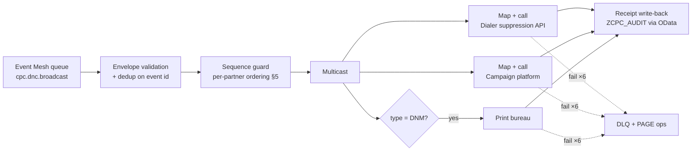

# iFlow Mapping Specification — IF_CPC_06 `IF_CPC_DNC_Broadcast`

**Version** 1.0 · **Status** For build · **Package** CPC (`cpc-solution-package.md` §5)

Distributes **Do-Not-Call / Do-Not-Mail changes** from S/4HANA to every outbound
communication system (dialers, campaign/marketing platforms, print bureau) with
guaranteed delivery and full audit. **This is a compliance interface**: a DNC that a
dialer never learns about is a regulatory violation, so its failure handling is
stricter than every other iFlow in the package.

> **[validate]**: Event Mesh topic wiring from the RAP event (ENH-05), each target
> system's suppression API (dialer/campaign/print vendors differ), and your regulatory
> SLA value (spec assumes **15 minutes** — confirm with compliance).

---

## 1. Interface overview

| Attribute | Value |
|---|---|
| iFlow name | `IF_CPC_DNC_Broadcast` |
| Direction | S/4 → downstream (asynchronous, event-driven) |
| Sender | SAP Event Mesh, queue `cpc.dnc.broadcast` subscribed to topic `zcpc/DncChanged` (also carries `DnmChanged`, `ThirdPartyChanged` — all BP-scope privacy types) |
| Sender adapter | AMQP (Event Mesh) |
| Receivers | R1 outbound dialer suppression API · R2 campaign/marketing platform · R3 print bureau (DNM only) — one receiver branch each, multicast **[validate each API]** |
| QoS | **Exactly-once effective**: at-least-once delivery + idempotent targets (event `id` dedup) |
| Ordering | Per-partner sequencing (§5) — a WITHDRAWN after GRANTED must never apply out of order |
| SLA | Every target confirmed within **15 min** of the S/4 commit; breach = ops page |
| Retry | Exponential backoff 1/2/4/8/16 min ×6 per target → target-specific DLQ → **page ops** (not just alert) |
| Audit | Delivery receipt per target written back to `ZCPC_AUDIT` (§6) |
| Reconciliation | Daily full-snapshot compare (§7) — retries alone are not sufficient evidence for compliance |

## 2. Processing steps



Each receiver branch retries **independently** — a dialer outage must not delay the
campaign platform.

## 3. Source message — `zcpc/DncChanged` (CloudEvents 1.0)

Published by ENH-05 in the same transaction scope as the preference save.

```json
{
  "specversion": "1.0",
  "type": "zcpc.DncChanged.v1",
  "source": "/s4/zcpc",
  "id": "d0a4f8c2-7e91-4b5a-8c1d-2f6e9a3b7c50",
  "time": "2026-08-17T18:12:03Z",
  "datacontenttype": "application/json",
  "data": {
    "businessPartner": "0001000567",
    "preferenceType": "DNC",
    "value": "IN",
    "channelSuppressed": "VOICE",
    "validFrom": "2026-08-17",
    "sequenceNo": 7,
    "source": "PORTAL",
    "changedBy": "SELF",
    "preferenceUUID": "3f1e…",
    "correlationId": "…"
  }
}
```

`sequenceNo` is a **per-partner monotonic counter** maintained by S/4 (`ZCPC_SEQ`
number range per partner) — the ordering authority for §5.

## 4. Field mappings per receiver

### 4.1 R1 — Outbound dialer suppression list (generic REST; concrete API **[validate]**)

| # | Source (`data.*`) | Target (dialer) | Transformation |
|---|---|---|---|
| 1 | `businessPartner` | `customerRef` | ALPHA-stripped (no leading zeros) **[confirm dialer key]** — if the dialer keys on phone number, enrich: OData lookup `I_BusinessPartner` phone numbers **[validate]** and send one suppression entry per number |
| 2 | `value` | `action` | `IN → ADD` (add to DNC list), `OUT → REMOVE` |
| 3 | `preferenceType` | `listType` | `DNC → DO_NOT_CALL`; `DNM` not sent to dialer (skip branch) |
| 4 | `validFrom` | `effectiveDate` | ISO date pass-through |
| 5 | `id` (envelope) | `externalRef` | Idempotency key at the dialer |
| 6 | — | `reason` | Constant `CUSTOMER_PREFERENCE` |

### 4.2 R2 — Campaign / marketing platform

| # | Source | Target | Transformation |
|---|---|---|---|
| 1 | `businessPartner` | `contactKey` | Per platform key mapping **[validate]** |
| 2 | `preferenceType` + `value` | `channelConsent` object | `DNC/IN → {voice:"DENIED"}`; `DNM/IN → {print:"DENIED"}`; `THIRD_PARTY/IN|OUT → {dataSharing:…}`; `OUT` restores `ALLOWED` |
| 3 | `time` | `consentTimestamp` | Pass-through — platforms typically require the consent-change instant for their own audit |
| 4 | `id` | `eventId` | Idempotency |

### 4.3 R3 — Print bureau (DNM only)

`action ADD/REMOVE`, `addressRef` = partner; postal address **not** sent (bureau holds
address feed separately) — this interface only gates *whether* to print.

## 5. Ordering & race handling

- Queue is consumed with **partner-hash parallelism**: events for the *same* partner are
  processed serially (CPI: single worker per partition key = `businessPartner`); different
  partners in parallel. **[validate CPI parallelism config — else set queue to strict FIFO]**
- Each receiver call carries `sequenceNo`; the write-back (§6) records it. If an event
  arrives with `sequenceNo` ≤ the last *successfully broadcast* one for that partner
  (data store `CPC_DNC_SEQ`), it is **skipped as stale** and logged `SKIPPED_STALE` —
  a newer state has already been distributed.
- Rationale: with retries, `ADD` then `REMOVE` can invert; sequence-guarding at the
  iFlow (not just the target) makes inversion impossible even against targets with no
  ordering support.

## 6. Receipt write-back (audit evidence)

After **each** receiver branch succeeds: `POST` to `ZUI_CPC_PREF` audit ingestion
(action `logBroadcast` — add to RAP service):

| Field | Value |
|---|---|
| `PREF_ID` | `data.preferenceUUID` |
| `PARTNER` / `ACTION` | partner / `DNC_BROADCAST` |
| `NEW_VALUE` | `<target>:<ADD|REMOVE>:CONFIRMED` (e.g. `DIALER:ADD:CONFIRMED`) |
| `SOURCE` / `CHANGED_BY` | `CPI` / `IF_CPC_06` |
| `CORRELATION_ID` | from event |
| `TS` | receiver confirmation time — **this timestamp is the SLA evidence** |

Failure after all retries additionally writes `<target>:…:FAILED` before the DLQ park,
so the audit trail shows the breach without needing CPI access.

## 7. Reconciliation (daily)

Retries protect against transient loss; reconciliation protects against everything else:

1. 02:00 job: S/4 CDS `ZI_CPC_CustomerPref` extract of all **active BP-scope privacy
   rows** → canonical DNC/DNM list.
2. Pull each target's current suppression list (API or SFTP file per vendor **[validate]**).
3. Compare; differences → auto-repair (re-send ADD/REMOVE) + reconciliation report to
   compliance (count, partners, direction of drift).
4. Report retained with the audit data (same retention policy).

## 8. Error handling

| Failure | Behavior |
|---|---|
| Envelope invalid / unknown `type` | DLQ immediately (no retry), alert `DNC_BAD_EVENT` |
| Duplicate event `id` | Skip silently (idempotency), MPL note |
| Stale `sequenceNo` | Skip, log `SKIPPED_STALE` (not an error) |
| Target 4xx (bad request) | **No retry** — mapping/contract bug; DLQ + page (manual fix, then replay) |
| Target 401/403 | Retry ×2 only (credential rotation race), then DLQ + page |
| Target 5xx / timeout | Full retry ladder ×6 → DLQ + page |
| Write-back failure (receipt) | Retry ×6; if still failing, event **stays unacknowledged** (redelivered) — a broadcast without audit evidence counts as not done |
| SLA timer breach (15 min, CPI timer on message age) | Page ops even while retries continue |

## 9. Test cases

| # | Case | Expected |
|---|---|---|
| D1 | DNC set to IN via portal | Within SLA: dialer ADD, campaign voice=DENIED, audit `CONFIRMED` rows per target |
| D2 | DNC withdrawn (OUT) | REMOVE propagated; audit rows |
| D3 | Duplicate event redelivered | Single target call (dedup), no double audit |
| D4 | IN then OUT within seconds, OUT delivered first at target | Sequence guard blocks stale IN (`SKIPPED_STALE`); final state at all targets = OUT |
| D5 | Dialer down 40 min | Retries exhaust → DLQ + page; campaign branch unaffected; replay from DLQ succeeds; audit shows FAILED then CONFIRMED |
| D6 | DNM change | Print bureau + campaign called; dialer branch skipped |
| D7 | Reconciliation with seeded drift (partner on DNC in S/4, missing at dialer) | Auto-repair ADD + drift report line |
| D8 | Receipt write-back endpoint down | Event redelivered until receipt lands; no acknowledgement without evidence |

## 10. Open items

1. **[validate]** Dialer, campaign, print APIs + their keys (partner vs phone vs email).
2. Confirm SLA value (15 min assumed) and paging policy with compliance.
3. Add `logBroadcast` action + `ZCPC_SEQ` number range to the RAP build scope.
4. Decide reconciliation report recipient + format (proposal: email + stored CSV).
