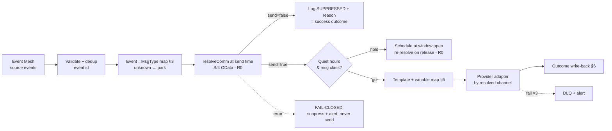

# iFlow Mapping Specification — IF_CPC_07 `IF_CPC_Comm_Dispatch`

**Version** 1.0 · **Status** For build · **Package** CPC (`cpc-solution-package.md` §5)

The **"communicate based on the preference"** flow. Consumes business events from source
systems (billing, OMS, DRMS, usage monitoring), asks S/4 **at send time** whether and how
to contact the customer (`resolveComm` → BRFplus `FN_RESOLVE_COMM`), and dispatches on
the resolved channel — or records a suppression with its reason. Suppression is a
*successful* outcome, never retried.

> **Non-negotiable rule (R0):** the preference decision is resolved **per message, at
> send time**. No caching of decisions across messages — a DNC set 10 seconds ago must
> suppress the next call. (Template content may be cached; decisions may not.)

> **[validate]**: source event topics per system, provider APIs (email/SMS/voice/print),
> quiet-hours legal window per jurisdiction, template IDs.

---

## 1. Interface overview

| Attribute | Value |
|---|---|
| iFlow name | `IF_CPC_Comm_Dispatch` |
| Direction | Event → S/4 decision → channel provider (async) |
| Sender | Event Mesh queue `cpc.comm.dispatch`, subscribed to the source topics in §3 |
| Receivers | S/4 `resolveComm` (OData function, sync) · provider adapters: Email (R-EM), SMS (R-SM), Voice/IVR (R-VC), Push (R-PU), Print (R-PR) **[validate each]** |
| QoS | At-least-once + provider idempotency key → effective exactly-once |
| Throughput | Normal < 5 msg/s; **outage storm mode** (§7): bursts to thousands — batching + provider rate limits |
| Retry | Provider 5xx: 30 s/2 min/10 min ×3 → DLQ + alert. `resolveComm` failure: **suppress-and-alert, never send** (fail-closed) |
| Audit | Every outcome (SENT / SUPPRESSED / FAILED) written to `ZCPC_AUDIT` (§6) |
| Quiet hours | Voice/SMS held 21:00–08:00 recipient-local (§7) except safety class **[validate legal window]** |

## 2. Processing steps

## 3. Source events — event → message-type map (VM-10)

| Source topic **[validate]** | Producer | `msgType` | Class | Template |
|---|---|---|---|---|
| `s4/billing/BillCreated` | S/4 Convergent/CI billing | `BILL_READY` | routine | `TPL_BILL_READY` |
| `s4/fica/PaymentReceived` | FI-CA | `PAY_CONFIRM` | routine | `TPL_PAY_CONFIRM` |
| `s4/fica/PaymentDueReminder` | FI-CA / dunning | `PAY_REMIND` | routine | `TPL_PAY_REMIND` |
| `s4/fica/PastDueNotice` | FI-CA dunning | `PAST_DUE` | **regulatory** | `TPL_PAST_DUE` |
| `oms/OutageDetected` | OMS | `OUT_DETECT` | **safety** | `TPL_OUT_DETECT` |
| `oms/RestorationEstimate` | OMS | `OUT_ETR` | safety | `TPL_OUT_ETR` |
| `oms/PowerRestored` | OMS | `OUT_RESTORE` | safety | `TPL_OUT_RESTORE` |
| `oms/PlannedOutage` | OMS | `OUT_PLANNED` | routine | `TPL_OUT_PLANNED` |
| `drms/EventDispatch` | DRMS | `DR_EVENT` | time-critical | `TPL_DR_EVENT` |
| `cpc/usage/HighUsage` | usage monitor | `HIGH_USAGE` | routine | `TPL_HIGH_USAGE` |
| `cpc/usage/ProjectedBill` | usage monitor | `BILL_PROJ` | routine | `TPL_BILL_PROJ` |
| (unknown topic/type) | — | — | — | Park to DLQ `COMM_UNKNOWN_EVENT` (no guessing) |

Message **class** drives quiet-hours and storm behavior: `safety` ignores quiet hours;
`regulatory` (PAST_DUE) never expires in storm collapse; `routine` may be delayed/collapsed.

Minimum source payload contract (all producers): `businessPartner`, `contractAccount`
(optional for BP-level messages), business keys for template variables, event `id`, `time`.

## 4. Decision call — `resolveComm` request/response mapping

Request (`POST <ZUI_CPC_PREF>/resolveComm`):

| # | Source | Target | Notes |
|---|---|---|---|
| 1 | event `data.businessPartner` | `PARTNER` | ALPHA 10 |
| 2 | event `data.contractAccount` | `VKONT` | Optional; initial → BP-level resolution only |
| 3 | VM-10 result | `MSG_TYPE` | |
| 4 | envelope `id` | `EVENT_ID` | For S/4-side logging |
| 5 | envelope `time` | `EVENT_TS` | Staleness check: events older than the per-class TTL (§7) are suppressed `EXPIRED` |

Response → routing decision:

| Field | Values | iFlow use |
|---|---|---|
| `SEND` | `X`/`''` | Branch send vs suppress |
| `CHANNEL` | EMAIL/SMS/VOICE/PUSH/POST | Selects provider adapter |
| `ADDRESS` | resolved address (email, E.164 number, device token, address ref) | Provider `to` — **the iFlow never looks up addresses itself**; S/4 resolves from BP master data so address and decision are consistent |
| `REASON` | `OK` / `OPTED_OUT` / `DNC_FALLBACK` / `DNC_NO_ALTERNATIVE` / `DNM_FALLBACK` / … | Audit + (fallback note in MPL) |
| `PREF_UUID` | governing record | Audit linkage |

## 5. Provider mapping (per resolved channel)

Common fields for all providers:

| # | Source | Target | Notes |
|---|---|---|---|
| 1 | `ADDRESS` (from resolveComm) | `to` | Never from the event payload |
| 2 | VM-10 template | `templateId` | Per-channel variant: `TPL_BILL_READY_EMAIL` / `_SMS` … **[validate IDs]** |
| 3 | event business keys | `variables{}` | Per-template variable map (VM-11, template annex — e.g. BillCreated: `amount`, `dueDate`, `billPeriod`, `accountLast4`) |
| 4 | envelope `id` + channel | `clientRef` | Provider idempotency key (`<eventId>:<channel>`) |
| 5 | class | `priority` | safety/time-critical → provider high-priority lane where supported |

Channel notes: **Email (R-EM)** adds `replyTo`, list-unsubscribe header for
marketing-class only; **SMS (R-SM)** enforces 320-char template budget + sender ID per
country **[validate]**; **Voice (R-VC)** passes IVR flow ID, respects provider's
answering-machine policy; **Push (R-PU)** silently downgrades to `OPTED_OUT`-style
suppression if the device token is stale (reason `TOKEN_INVALID`); **Print (R-PR)**
batches daily except regulatory class (next print run).

PII rule: `variables{}` carry no more than the template needs; full payloads are never
logged; MPL stores partner + msgType + outcome only.

## 6. Outcome write-back (audit)

One `logDispatch` call (RAP action, add to service) per message:

| Field | SENT | SUPPRESSED | FAILED |
|---|---|---|---|
| `ACTION` | `COMM_SENT` | `COMM_SUPPRESSED` | `COMM_FAILED` |
| `NEW_VALUE` | `<msgType>:<channel>` | `<msgType>:<reason>` | `<msgType>:<channel>:<error>` |
| `PREF_ID` | governing `PREF_UUID` | same | same |
| `CORRELATION_ID` | event id | event id | event id |

Suppressions are first-class evidence — they prove DNC/opt-out was honored.

## 7. Storm mode, TTL, quiet hours

- **TTL per class** (staleness at resolve time): safety 2 h · time-critical 1 h ·
  routine 24 h · regulatory ∞. Expired → `SUPPRESSED/EXPIRED`.
- **Outage storm**: when queue depth > threshold (e.g. 5 000), routine class is deferred
  (secondary queue) and OMS events for the same premise+type within 10 min are
  **collapsed to the latest** (dedup key `premise:msgType`); safety class always flows.
  Provider rate limits configured per adapter **[validate provider caps]**.
- **Quiet hours**: VOICE/SMS held 21:00–08:00 recipient-local (timezone from premise
  region; default plant timezone) for routine class; held messages are **re-resolved on
  release** (R0 — preferences may have changed overnight). Safety + regulatory ignore
  quiet hours **[validate legal position for PAST_DUE voice]**.

## 8. Error handling

| Failure | Behavior |
|---|---|
| Unknown event/topic | DLQ `COMM_UNKNOWN_EVENT`, no retry |
| Duplicate event id | Skip (dedup store, 48 h TTL) |
| `resolveComm` timeout/5xx | **Fail closed**: retry ×2 (10 s), then `SUPPRESSED/RESOLVE_UNAVAILABLE` + alert. Never dispatch without a fresh decision |
| Provider 4xx (bad template/variables) | DLQ + alert (build defect), no retry |
| Provider 401/403 | Retry ×2 (credential race) → DLQ + alert |
| Provider 5xx/timeout | Retry ladder ×3 → DLQ + alert; audit `COMM_FAILED` |
| Write-back failure | Retry until success; message unacknowledged without audit evidence (same rule as IF_CPC_06) |
| Address empty from resolveComm | `SUPPRESSED/NO_ADDRESS` + customer-notify task for CSR follow-up (ENH-03 also catches this proactively) |

## 9. Test cases

| # | Case | Expected |
|---|---|---|
| C1 | BillCreated, customer opted in EMAIL | resolveComm OK/EMAIL → email sent, audit `COMM_SENT BILL_READY:EMAIL` |
| C2 | PAY_REMIND on VOICE, DNC active | Resolved fallback (SMS/EMAIL per policy), note `DNC_FALLBACK`, sent on fallback channel |
| C3 | Marketing-class event, customer opted out | `SUPPRESSED/OPTED_OUT`; no provider call; audit row |
| C4 | DNC set between two events (seconds apart) | Second event suppressed/fallback — proves R0 no-cache |
| C5 | resolveComm down | No send; `SUPPRESSED/RESOLVE_UNAVAILABLE` + alert (fail-closed) |
| C6 | OutageDetected at 02:00 (safety) | Sent immediately despite quiet hours |
| C7 | Routine HIGH_USAGE at 23:00 | Held; released 08:00; **re-resolved** at release |
| C8 | Outage storm 10 000 events, 3 updates same premise | Collapsed to latest per premise; safety lane unaffected; providers stay under rate caps |
| C9 | Stale routine event (26 h old) | `SUPPRESSED/EXPIRED` |
| C10 | Provider hard-down 1 h | Retries → DLQ + alert; replay after recovery re-resolves first (R0) |

## 10. Open items

1. **[validate]** Source topics + payload contracts with each producer team (billing, OMS, DRMS).
2. **[validate]** Provider adapters + rate caps + template IDs; build VM-11 template-variable annex per template.
3. Confirm quiet-hours legal window and whether PAST_DUE voice is exempt.
4. Storm thresholds + collapse window (5 000 / 10 min proposed) with OMS ops.
5. Add `logDispatch` action to the RAP service build scope (with `logBroadcast` from IF_CPC_06).
