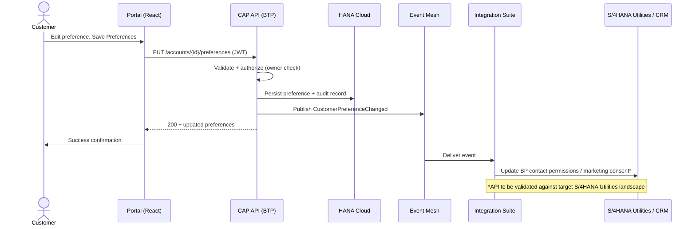
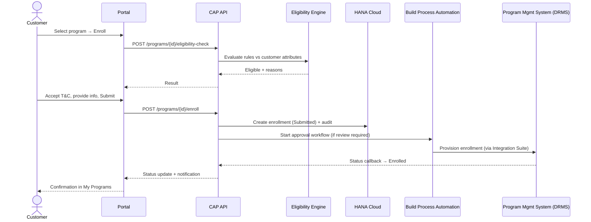
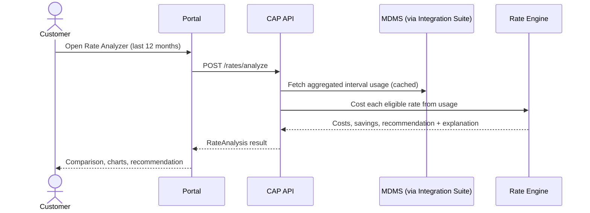
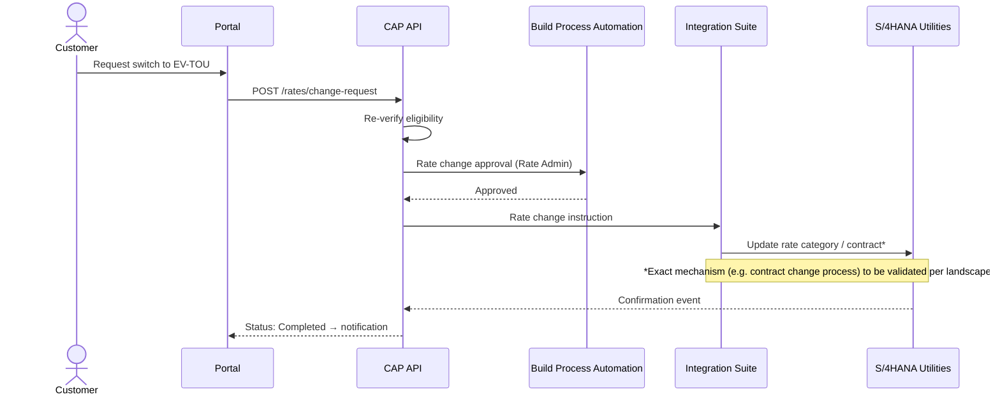

# Deliverable 3–6 — Functional Design, Customer Journeys, UX Specification & Wireframes

## 1. Information architecture

```
SmartGrid Energy Portal
├── Login
├── Home Dashboard
│   └── Quick actions: Pay Bill · View Usage · Manage Preferences ·
│       Explore Programs · Analyze My Rate · Report Outage
├── Preference Center
│   ├── Communication   ├── Billing        ├── Usage Alerts
│   ├── Outage          ├── Program Comms  ├── Marketing
│   └── Privacy & Consent
├── Programs
│   ├── Marketplace (filters + cards)
│   ├── Program Details / Eligibility / Enrollment wizard
│   └── My Programs
├── Rates
│   ├── Rate Analyzer (analysis + comparison + recommendation)
│   ├── Rate Simulator ("What if?")
│   └── Rate Change Request + Confirmation
├── Notification Center
└── Profile (+ Account Selector in the header)
```

## 2. Screen inventory (22 screens)

| # | Screen | Demo route | Notes |
|---|---|---|---|
| 1 | Login | `/login` | Mock auth in demo; IAS/OIDC in production |
| 2 | Home Dashboard | `/` | KPI tiles, usage trend, opportunities, alerts |
| 3 | Account Selector | header component | Switches active contract account |
| 4 | Preference Center | `/preferences` | Tabbed hub for 5–9 |
| 5 | Communication Preferences | `/preferences` (tab) | Channels + preferred channel |
| 6 | Billing Preferences | `/preferences` (tab) | Paperless + billing notices |
| 7 | Energy Usage Alerts | `/preferences` (tab) | Thresholds with numeric inputs |
| 8 | Outage Preferences | `/preferences` (tab) | Event × channel matrix |
| 9 | Privacy & Consent | `/preferences` (tab) | Consents + consent history |
| 10 | Program Marketplace | `/programs` | Cards + filter chips |
| 11 | Program Details | `/programs/:id` | Full description, incentives, terms |
| 12 | Program Eligibility | `/programs/:id` | Rule-by-rule eligibility result |
| 13 | Program Enrollment | `/programs/:id/enroll` | Wizard: details → T&C → info → submit |
| 14 | My Programs | `/my-programs` | Enrollment history + statuses |
| 15 | Rate Analyzer | `/rates` | Period selector, computed costs per rate |
| 16 | Rate Comparison | `/rates` (section) | Current vs. alternatives table + bar chart |
| 17 | Rate Simulator | `/rates/simulator` | Behavior sliders/toggles, live recalc |
| 18 | Rate Recommendation | `/rates` (section) | Best rate + confidence + explanation |
| 19 | Rate Change Request | `/rates` (dialog) | Submit request for eligible rate |
| 20 | Confirmation | inline/dialog | Enrollment + rate change confirmations |
| 21 | Notification Center | `/notifications` | All portal notifications |
| 22 | Customer Profile | `/profile` | Contact data, premises, meters |
| 23 | CSR Agent View | `/agent` | Internal Customer 360 mirror (read-only in demo), on-behalf-of audit attribution — sign in via "Sign in as CSR" |

## 3. Wireframes (screen-by-screen, textual)

### 3.1 Home Dashboard
```
┌──────────────────────────────────────────────────────────────────────┐
│ ☰  SmartGrid Energy      [Account: 123 Green Street ▼]   🔔  Alex ▾ │
├────────────┬─────────────────────────────────────────────────────────┤
│ Dashboard  │  Good morning, Alex                                     │
│ Preferences│  ┌────────┐ ┌────────┐ ┌────────┐ ┌────────┐            │
│ Programs   │  │Balance │ │Next pay│ │Rate    │ │Est.bill│            │
│ My Programs│  │$142.75 │ │Aug 05  │ │R1 Std  │ │$168    │            │
│ Rates      │  └────────┘ └────────┘ └────────┘ └────────┘            │
│ Simulator  │  [Pay Bill][View Usage][Preferences][Programs]          │
│ Notifs     │  [Analyze My Rate][Report Outage]                       │
│ Profile    │  ┌ Monthly usage (12 mo line chart) ┐ ┌ Peak/off donut ┐│
│            │  └───────────────────────────────────┘ └───────────────┘│
│            │  Savings opportunities ▸ EV-TOU could save ~$XX/yr      │
│            │  Recommended programs ▸ [card][card][card]              │
└────────────┴─────────────────────────────────────────────────────────┘
```

### 3.2 Preference Center
```
Tabs: [Communication][Billing][Usage Alerts][Outage][Programs][Marketing][Privacy]
Communication:  ◉ Email  ◯ SMS  ◯ Push …   Preferred channel: (Email ▼)
Each row: label · description · toggle
Sticky footer: [Save Preferences]  → success toast + audit entry
Privacy tab: consent cards (granted/withdrawn, effective/expiry) + Consent History table
```

### 3.3 Program Marketplace
```
Filter chips: All · Eligible for Me · Recommended · Enrolled · Efficiency · DR · EV · Solar · Assistance
Card grid (3-up desktop / 1-up mobile):
┌──────────────────────────┐
│ CATEGORY BADGE   status  │
│ Program name             │
│ Short description        │
│ 💲 Incentive  📉 Savings │
│ Enrollment period · cap  │
│ [Learn More][Check Elig.][Enroll Now] │
└──────────────────────────┘
```

### 3.4 Rate Analyzer
```
Period: (Last 12 months ▼)   Account: (…▼)
Recommendation banner: ★ EV Time-of-Use — save $XXX/yr (confidence 87%) — "why?"
Comparison table: rate · annual cost · monthly avg · savings $ · savings % · risk · [Request switch]
Bar chart: annual cost per rate (current highlighted)
```

### 3.5 Rate Simulator
```
Left: controls — EV charging window (Evening/Overnight), EV monthly kWh slider,
thermostat setback toggle, peak-shift %, solar kW, battery toggle, consumption growth %
Right: live results — cost per rate (recalculated), best plan, monthly savings chart
"What if I charge my EV after 11 PM?" preset button applies the overnight scenario.
```

*(Remaining screens follow the same layout system; the demo app is the living wireframe.)*

## 4. Customer journey sequence diagrams

### 4.1 Preference change



### 4.2 Program enrollment



### 4.3 Rate analysis



### 4.4 Rate change



## 5. UX design specification

- **Brand**: "SmartGrid Energy" — professional fictional utility. Primary brand color
  deep teal-green `#0a6e5c`; accent blue `#2a78d6` (also chart series 1). No real
  utility logos.
- **Design language**: card-based dashboard, SAP Horizon-inspired (clean surfaces,
  generous whitespace, 12px radii, subtle elevation), or directly implementable with
  UI5 Web Components for React in a later iteration.
- **Type**: system sans (`system-ui, "Segoe UI", sans-serif`); tabular numerals only
  in tables/axes.
- **Data-viz**: validated categorical palette (blue, green, magenta, yellow…), thin
  marks, 2px lines, hairline grids, legends for ≥2 series, hover tooltips, light/dark
  aware tokens.
- **Responsive**: sidebar → bottom/hamburger nav under 900px; card grids collapse
  3→2→1; charts fluid width.
- **Accessibility (WCAG 2.1 AA-oriented)**: semantic landmarks, labeled inputs,
  focus-visible rings, 4.5:1 text contrast, status conveyed with icon + text (never
  color alone), keyboard-operable toggles/tabs, `aria-live` for toasts.
- **Error handling UX**: customer-safe messages ("We're unable to retrieve your usage
  information right now."), retry action, correlation ID surfaced in a details
  disclosure for support calls.
