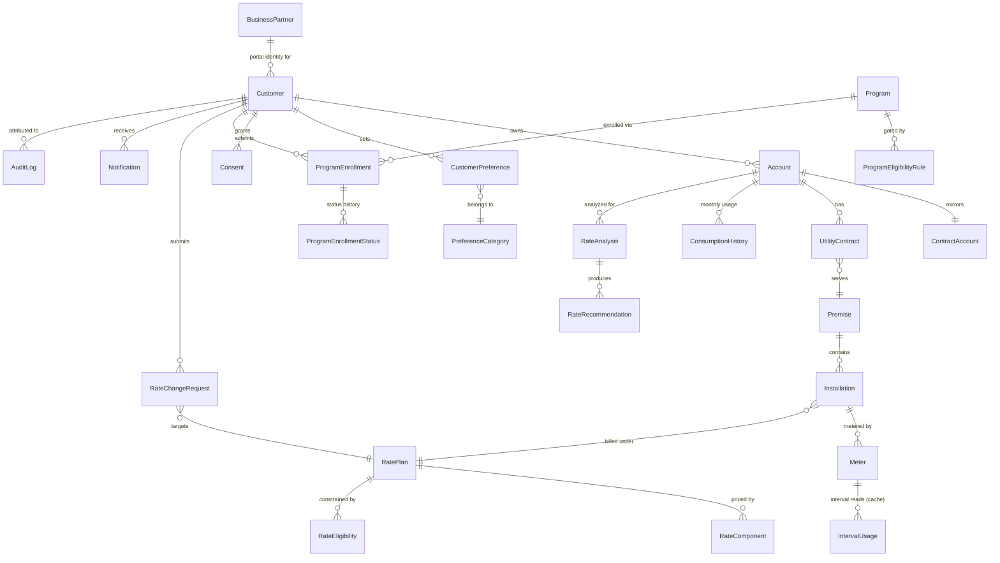

# Deliverable 12 — Data Model & ER Diagram

Portal system-of-record entities (HANA Cloud via CAP CDS — see `cap/db/schema.cds`).
S/4HANA Utilities remains the system of record for BP, contract account, contract,
premise, installation, device, and tariff master data; the portal persists a
**presentation/replica subset** of those (kept in sync via integration) plus its own
transactional data (preferences, consents, enrollments, analyses, requests, audit).

## ER diagram

## Entity catalog

Conventions: `ID` = UUID primary key unless noted; timestamps `createdAt/modifiedAt`
+ user fields come from CAP `managed` aspect; monetary `Decimal(15,2)`, energy
`Decimal(12,3)` kWh, demand `Decimal(9,3)` kW.

| Entity | PK | Key FKs | Notable attributes |
|---|---|---|---|
| **Customer** | ID | businessPartner_ID | customerType (RES/COM), firstName, lastName, email, phone, portalUserId (IAS subject), hasEV, hasSolar, hasBattery, hasSmartThermostat, incomeQualified (Boolean, verified flag) |
| **BusinessPartner** | ID (S/4 BP number, String(10)) | — | bpCategory, name, replicatedAt |
| **Account** | ID | customer_ID, contractAccount_ID | accountNumber String(12), displayName, serviceAddress, status, currentBalance, nextPaymentDate, autoPay Boolean |
| **ContractAccount** | ID (S/4 CA number) | businessPartner_ID | companyCode, paymentTerms, replicatedAt |
| **UtilityContract** | ID (S/4 contract no.) | account_ID, premise_ID, installation_ID | division (01 elec/02 gas/03 water), moveInDate, moveOutDate, status |
| **Premise** | ID | — | street, city, region, postalCode, premiseType (HOUSE/APT/COMMERCIAL), serviceTerritory |
| **Installation** | ID | premise_ID, ratePlan_ID | division, billingClass, status |
| **Meter** | ID | installation_ID | serialNumber, meterType (AMI/AMR/MANUAL), isSmartMeter Boolean, installDate, lastReadAt |
| **RatePlan** | ID (code, String(12)) | — | name, description, rateType (FLAT/TIERED/TOU/SEASONAL/DEMAND), customerType, riskLevel (LOW/MED/HIGH), isActive, effectiveFrom/To |
| **RateComponent** | ID | ratePlan_ID | componentType (FIXED/ENERGY/TIER/TOU/DEMAND), season (ALL/SUMMER/WINTER), touPeriod (PEAK/OFFPEAK/SUPER_OFFPEAK), tierFromKwh, tierToKwh, price Decimal(9,5), unit ($/mo, $/kWh, $/kW) |
| **RateEligibility** | ID | ratePlan_ID | attribute, operator, value (rule rows: e.g. customerType=RES, hasEV=true, isSmartMeter=true) |
| **ConsumptionHistory** | ID | account_ID, meter_ID | yearMonth String(7), totalKwh, peakKwh, offPeakKwh, superOffPeakKwh, peakDemandKw, billedAmount, source (BILLING/MDMS) |
| **IntervalUsage** | ID | meter_ID | readingDate, intervalStart, kWh, touPeriod, quality; **cache table**, TTL-purged |
| **PreferenceCategory** | code String(30) | — | name, description, section (COMMUNICATION/BILLING/ALERTS/OUTAGE/PROGRAMS/MARKETING/PRIVACY) |
| **CustomerPreference** | ID | customer_ID, account_ID, category_code | preferenceKey, value String(100), channel, thresholdValue Decimal, effectiveDate, source (WEB/CSR/IVR/MIGRATION) |
| **Consent** | ID | customer_ID | consentType (PRIVACY_POLICY/THIRD_PARTY/ANALYTICS/SMART_METER/MARKETING), status (GRANTED/WITHDRAWN/EXPIRED), effectiveDate, expirationDate, policyVersion, capturedVia |
| **Program** | ID (code) | — | name, category (EFFICIENCY/DEMAND_RESPONSE/EV/RENEWABLE/ASSISTANCE), shortDescription, longDescription, estimatedSavings, incentiveAmount, incentiveText, enrollmentStart/End, capacity Integer, enrolledCount, termsUrl/termsText, isActive |
| **ProgramEligibilityRule** | ID | program_ID | attribute, operator (EQ/NE/GTE/LTE/IN), value, failureOutcome (NOT_ELIGIBLE/INFO_REQUIRED/POTENTIAL), failureReason |
| **ProgramEnrollment** | ID | program_ID, customer_ID, account_ID | status (DRAFT/SUBMITTED/UNDER_REVIEW/INFO_REQUIRED/APPROVED/ENROLLED/REJECTED/CANCELLED), submittedAt, decidedAt, termsAcceptedAt, termsVersion, providedInfo (JSON), externalRef (DRMS id) |
| **ProgramEnrollmentStatus** | ID | enrollment_ID | status, statusAt, actor, note (full status history) |
| **RateAnalysis** | ID | account_ID, customer_ID | periodFrom, periodTo, monthsAnalyzed, currentRate_ID, currentAnnualCost, resultJson (per-rate costs), runAt |
| **RateRecommendation** | ID | analysis_ID, recommendedRate_ID | estimatedAnnualCost, estimatedSavings, savingsPercent, confidenceScore Decimal(4,3), explanation Text, engineVersion |
| **RateChangeRequest** | ID | customer_ID, account_ID, fromRate_ID, toRate_ID | status (SUBMITTED/UNDER_REVIEW/APPROVED/COMPLETED/REJECTED/CANCELLED), requestedAt, effectiveDate, decidedBy, reason |
| **Notification** | ID | customer_ID, account_ID | type, title, body, channel, severity, isRead, sentAt, relatedEntity/relatedId |
| **AuditLog** | ID | customer_ID | account_ID, entityType, entityId, action, category, previousValue, newValue, effectiveDate, source, actorUserId, actorRole (CUSTOMER/CSR/...), timestamp, correlationId |

**Audit rule:** every write to CustomerPreference, Consent, ProgramEnrollment,
RateChangeRequest produces an AuditLog row in the same transaction (CAP `before`/
`after` handlers), capturing previous value, new value, source and acting user —
including CSR-on-behalf-of attribution.

**PII handling:** name/email/phone columns are classified `@PersonalData` in CDS for
DPP (data privacy) tooling; consent withdrawal triggers downstream propagation events;
retention/erasure via SAP Data Retention Manager patterns in Phase 2.
