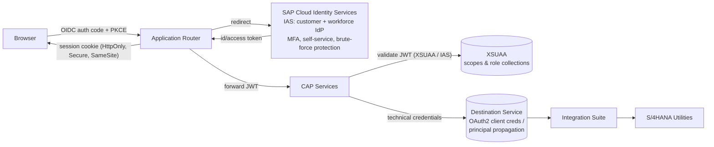

# Deliverable 14–15 — Security Architecture & Event-Driven Architecture

## 1. Security architecture



### Identity model

| Population | IdP | Notes |
|---|---|---|
| Customers | IAS (customer identity, self-registration + verified link to BP/account) | MFA optional, risk-based |
| CSRs / admins | IAS federated to corporate IdP (Azure AD etc.) | MFA required |

### Roles & authorization (XSUAA `xs-security.json`, see `cap/`)

| Role collection | Scope | Grants |
|---|---|---|
| SmartGrid_Customer | `$XSAPPNAME.Customer` | Own accounts/preferences/enrollments/analyses only |
| SmartGrid_CSR | `$XSAPPNAME.CSR` | Read any customer, act on behalf **with audit attribution** |
| SmartGrid_ProgramAdmin | `$XSAPPNAME.ProgramAdmin` | Program + eligibility rule maintenance, enrollment review |
| SmartGrid_RateAdmin | `$XSAPPNAME.RateAdmin` | Rate maintenance, rate change review |
| SmartGrid_PortalAdmin | `$XSAPPNAME.PortalAdmin` | Config, monitoring |

**Instance-based authorization (critical):** role = necessary, ownership = sufficient.
Every CAP handler resolves the caller's customer record from the JWT subject and
filters/validates `customer_ID`/`account_ID` on **every** read and write
(`CustomerService` `@restrict` + programmatic checks). 404 (not 403) for resources
outside the caller's ownership, to avoid resource enumeration.

### Controls checklist

- OAuth 2.0 / OIDC authorization code + PKCE; no tokens in localStorage (approuter
  session cookie pattern); JWT validated on every CAP request.
- **No SAP backend credentials in the browser** — Destination service holds all
  technical credentials; approuter forwards only same-origin `/api` calls.
- Encryption in transit: TLS 1.2+ everywhere (BTP-managed). At rest: HANA Cloud
  native encryption; backups encrypted.
- PII: `@PersonalData` CDS annotations; field-level read logging for CSR access to
  PII (SAP Audit Log service); masking in application logs.
- Consent audit history immutable (insert-only table, no update/delete exposed).
- CSRF protection via approuter; security headers (CSP, HSTS, X-Content-Type-Options).
- Rate limiting / spike arrest via API Management in front of S/4 & MDMS, and on the
  public API (login, eligibility-check, analyze).
- Secrets: service bindings only (no secrets in code/repo); credential rotation via
  destination updates.
- Audit logging: every preference/consent/enrollment/rate-change write → AuditLog +
  SAP Audit Log service; correlation ID from approuter propagated end-to-end.

## 2. Event-driven architecture (SAP Event Mesh)

```mermaid
flowchart LR
    CAP[Portal CAP Services] -->|publish| EM[[Event Mesh\ntopics: smartgrid/portal/*]]
    S4[S/4HANA Utilities] -->|business events| EM
    OMS[OMS] -->|outage events| EM
    EM -->|queue: crm-sync| IS1[iFlow → CRM/Marketing]
    EM -->|queue: drms-provision| IS2[iFlow → DRMS]
    EM -->|queue: s4-rate-change| IS3[iFlow → S/4 rate change]
    EM -->|queue: notifications| NOT[Notification dispatcher\n(email/SMS/push providers)]
    EM -->|DLQ per queue| DLQ[(Dead-letter queues\n→ Alert Notification → ops)]
```

Rationale: portal transactions commit locally and publish; downstream provisioning is
retried independently — customer UX never blocks on CRM/DRMS/S4 availability.

### Event catalog

| Event | Producer | Consumers | Payload (key fields) | Purpose | Retry / DLQ |
|---|---|---|---|---|---|
| `CustomerPreferenceChanged` | Portal | CRM sync, OMS, DRMS, Marketing | customerId, accountId, category, key, oldValue, newValue, channel, effectiveDate, source, correlationId | Propagate preferences to engagement systems | 5 retries exp. backoff → DLQ |
| `CustomerConsentChanged` | Portal | Marketing, analytics, consent repository | customerId, consentType, status, policyVersion, effective/expiry | Legal consent propagation (highest priority) | 8 retries → DLQ + page ops |
| `ProgramEnrollmentSubmitted` | Portal | DRMS provisioning iFlow | enrollmentId, programId, customerId, accountId, providedInfo | Trigger downstream provisioning | 5 retries → DLQ; status stays Submitted |
| `ProgramEnrollmentApproved` / `Rejected` | Workflow / DRMS callback | Portal (status update), Notification dispatcher | enrollmentId, decision, reason | Close the loop to the customer | 5 retries |
| `RateAnalysisCompleted` | Portal | Analytics, Marketing (savings campaigns, only if consented) | analysisId, accountId, recommendedRateId, savings | Analytics + targeted offers | 3 retries, non-critical |
| `RateChangeRequested` | Portal | Rate-admin workflow, S/4 iFlow | requestId, accountId, fromRateId, toRateId, effectiveDate | Start tariff change process | 5 retries → DLQ |
| `RateChangeCompleted` | S/4 (via iFlow) | Portal, Notification dispatcher | requestId, completedAt | Confirm switch to customer | 5 retries |
| `HighUsageAlertTriggered` | Usage monitor job | Notification dispatcher | accountId, thresholdType, thresholdValue, actualValue | Customer alerting per preference | 3 retries |
| `OutageNotificationRequested` | OMS | Notification dispatcher (channel per outage preferences) | outageId, premiseIds, eventType, ERT | Outage comms honoring preferences | aggressive retries (time-critical) |

Conventions: CloudEvents 1.0 envelope; topic namespace `smartgrid/portal/v1/<event>`;
consumers idempotent on event `id`; DLQ monitored via Alert Notification with runbook
links; poison messages replayable from DLQ after fix.
